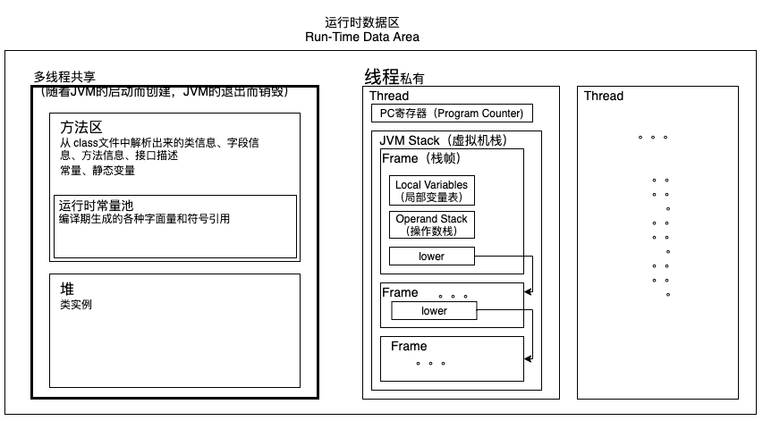

参考资料：
- <https://github.com/zxh0/jvmgo-book>
- 《自己动手写Java虚拟机》
- [Java语言规范、Java虚拟机规范](https://docs.oracle.com/javase/specs/index.html)
- <https://github.com/zxh0/classpy>  
    `cd /Users/nibnait/github/classpy && ./gradlew run`

## 解析 class 文件
 - 类文件 [ClassFile.java](./src/main/java/cc/tianbin/demo/jvm/classfile/ClassFile.java)
 - 常量池 [ClassFile#readconstantPool](./src/main/java/cc/tianbin/demo/jvm/classfile/constantpool/ConstantPool.java)
 - 属性表 [ClassFile#readAttributes](./src/main/java/cc/tianbin/demo/jvm/classfile/attributes/AttributeInfo.java)

## 运行时数据区

数据类型：  

## 指令表
[/instructions/README.md](./src/main/java/cc/tianbin/demo/jvm/instructions/README.md)

## 类和对象

类加载过程：[ClassLoader.loadClass()](./src/main/java/cc/tianbin/demo/jvm/rtda/heap/classloader/ClassLoader.java)

图9-1只画出了 Class 和 Object 结构体的必要字段，并且刻意分开了堆和方法区。  
在方法区中，class1 和 class2 分别是 java.lang.Object 和 java.lang.Class 类的数据。  
在堆中，object1 和 object2 分别是 java.lang.Object 和 java.lang.Class 的类对象。object3 是单独的 java.lang.Object 实例。

## 方法调用和返回

方法调用过程：[MethodInvokeLogic.invokeMethod()](./src/main/java/cc/tianbin/demo/jvm/instructions/base/MethodInvokeLogic.java)

## 数组和字符串

## 本地方法调用

## 异常处理

