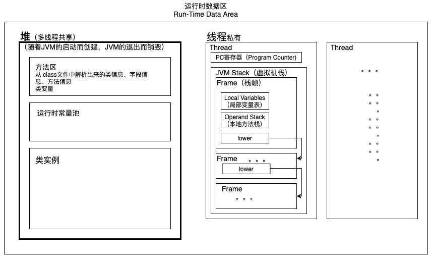

参考资料：
- <https://github.com/zxh0/jvmgo-book>
- 《自己动手写Java虚拟机》
- [Java语言规范、Java虚拟机规范](https://docs.oracle.com/javase/specs/index.html)
- <https://github.com/zxh0/classpy>  
    `cd /Users/nibnait/github/classpy && ./gradlew run`

## 解析 class 文件
 - 类文件 [ClassFile.java](./src/main/java/cc/tianbin/demo/jvm/classfile/ClassFile.java)
 - 常量池 [ClassFile#readconstantPool](./src/main/java/cc/tianbin/demo/jvm/classfile/constantpool/ConstantPool.java)
 - 属性表 [ClassFile#readAttributes](./src/main/java/cc/tianbin/demo/jvm/classfile/attributes/AttributeInfo.java)

## 运行时数据区

数据类型：  

## 指令表
[/instructions/README.md](./src/main/java/cc/tianbin/demo/jvm/instructions/README.md)